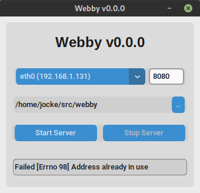

# The Webby Server

Webby is a simple web server with a user-friendly UI, built with Python
and [CustomTkInter][1] for the full cross-platform experience.



It is recommended to use Python3 virtual environment for 3rd party
software.  This ensures proper versions of all dependencies are used,
without leaking over to other programs.

Set up venv and source `activate`:

```
~/src/webby(main)$ python -m venv .venv
~/src/webby(main)$ source .venv/bin/activate
```

Calling the <cmd>python</cmd> command from now on (in this terminal)
uses the `.venv/bin/python`, same with the <cmd>pip</cmd> command which
we'll now use to install the requirements:

```
~/src/webby(main)$ pip install -r requirements.txt
...
```

> When done, call `deactivate` to "detach" from the venv.

## Updating

When adding new features to the project, remember to update the file
`requirements.txt` using:

```
~/src/webby(main)$ pip freeze > requirements.txt
...
```

[1]: https://customtkinter.tomschimansky.com/
